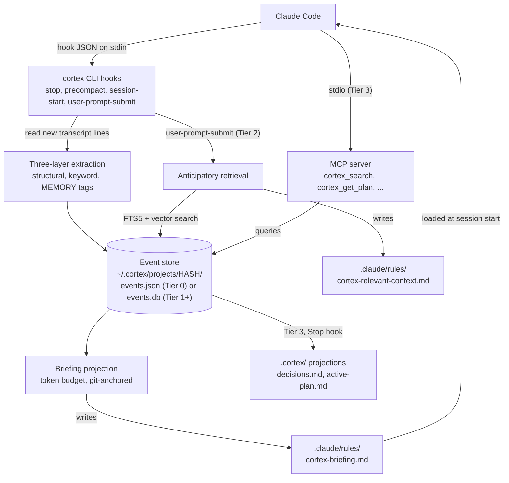

# Cortex: An Event-Sourced Memory Architecture for AI Coding Assistants

> Solving the context window boundary problem through automatic session continuity.

LLM coding assistants (Claude Code, Copilot, Cursor) lose all accumulated understanding when a session ends. **Cortex** is a memory architecture that captures session context automatically and projects it into future sessions as a token-budget-aware briefing — no model modifications or secondary LLM calls required.

This repository contains the **complete research project** that designed the Cortex architecture through iterative convergence: problem definition, solution survey, architecture design, comparative scoring, adversarial failure analysis, and mitigation engineering.

## The Problem

When an AI coding session ends, the assistant loses:

| Category | What's Lost | Impact |
|----------|------------|--------|
| Mental Model | Codebase understanding built through exploration | 10-30 min re-exploration per session |
| Decision History | Choices made, alternatives rejected with reasoning | Re-suggests rejected approaches |
| Work State | Multi-step plans, progress, partial implementations | Plans fragment across sessions |
| Tool State | Modified files, git state, environment config | Must rediscover current state |
| Conversational Nuance | User preferences, communication style, priorities | Human becomes the memory system |

## The Solution: Cortex

Cortex is an **event-sourced memory system** with three key subsystems:

**Three-Layer Event Extraction** captures context automatically:
- **Layer 1 (Structural)**: Parses tool call metadata from hook payloads — 100% accuracy for its scope
- **Layer 2 (Keyword)**: Pattern-matches Claude's response text for decision markers — confidence-scored
- **Layer 3 (Self-Reporting)**: Claude flags decisions via `[MEMORY:]` tags — highest accuracy, trivially parseable

**Projected Briefings** generate token-budget-aware context summaries:
- Reality-anchored against git state and config files
- Annotated with confidence markers and provenance tracking
- Decisions are immortal (never lost to decay) with tiered representation

**Progressive Tiers** enable incremental adoption:

| Tier | Install Time | What You Get | Status |
|------|-------------|-------------|--------|
| **Tier 0** | 30 seconds | JSON storage, three-layer extraction, basic briefing | Implemented |
| **Tier 1** | 2 minutes | SQLite + FTS5, snapshot caching, migration CLI | Implemented |
| **Tier 2** | 5 minutes | Vector embeddings, hybrid search, anticipatory retrieval | Implemented |
| **Tier 3** | 10 minutes | MCP server, branch alignment, git-tracked projections | Implemented |

## Research Methodology

The architecture was selected through **iterative convergence**, not designed in isolation:

```
Define problem rigorously (5 categories, 10 FRs, 8 NFRs)
    |
Survey 15+ existing solutions (9 design patterns identified)
    |
Brainstorm 5 candidate architectures
    |
Compare and rank (weighted scoring, 10 criteria) --> Select top 2
    |
Generate 3 hybrid architectures from best ideas
    |
Compare all 5 remaining (11 criteria, 210 points) --> Winner: Cortex (185/210)
    |
Adversarial failure analysis (19 failure modes identified)
    |
Engineer mitigations (all risks reduced to <= 8/25)
    |
External evaluation + response (all P0/P1 gaps addressed)
```

## Research Artifacts

All intermediate work products are preserved for transparency:

| Document | Description |
|----------|-------------|
| [Research Paper](docs/research/paper/cortex-research-paper.md) | Full paper with 15 sections + appendices |
| [Master Plan](docs/research/MASTER-PLAN.md) | Progress tracker and decision log |
| [Problem Definition](docs/research/phases/01-problem-definition.md) | 5 categories of lost context, formal requirements |
| [Existing Solutions Survey](docs/research/phases/02-existing-solutions.md) | 15+ solutions, 9 design patterns |
| [Brainstorm Round 1](docs/research/phases/03-brainstorm-r1.md) | 5 architectures: Journal, Palace, Git, Event Sourcery, Dual-Mind |
| [Comparison Round 1](docs/research/comparisons/04-comparison-r1.md) | Top 2: Event Sourcery + Dual-Mind |
| [Deep Research + Hybrids](docs/research/phases/05-deep-research.md) | 3 hybrids: Cortex, Engram, Chronicle |
| [Comparison Round 2](docs/research/comparisons/06-comparison-r2.md) | Winner: Cortex (185/210, 14-point margin) |
| [Failure Analysis](docs/research/phases/08-failure-analysis.md) | 19 failure modes, 2 critical, 6 high-risk |
| [Mitigations](docs/research/phases/09-mitigations.md) | All risks reduced to max 8/25 |
| [External Evaluation](docs/research/evaluation/external-evaluation.md) | Independent stress-test of the plan |
| [Evaluation Response](docs/research/evaluation/evaluation-response.md) | Point-by-point response to all gaps |

## Tier 1 Features

Tier 1 upgrades storage from JSON to SQLite with full-text search:

### SQLite Storage
- **WAL mode** for concurrent reads during writes
- **100K+ event capacity** with batch insertion
- **Content-hash deduplication** prevents duplicate events

### FTS5 Full-Text Search
- **BM25 ranking** for relevance-scored results
- **Type and branch filtering** for targeted queries
- **Snippet generation** with match highlighting

```python
from cortex import search, search_decisions

# Search all events
results = search(conn, "authentication", limit=10)

# Search only decisions
decisions = search_decisions(conn, "database")
```

### Snapshot Caching
- **Sub-10ms briefing retrieval** from cache
- **Branch-specific snapshots** for context isolation
- **Auto-invalidation** when new events are appended

### Migration CLI

Upgrade from Tier 0 (JSON) to Tier 1 (SQLite):

```bash
cortex upgrade           # Migrate to SQLite
cortex upgrade --dry-run # Preview what would be done
cortex upgrade --force   # Overwrite existing SQLite
```

Migration creates a timestamped backup and archives JSON files after successful migration.

## Tier 2 Features

Tier 2 adds semantic understanding through vector embeddings and anticipatory retrieval:

### Embedding Infrastructure
- **SentenceTransformers** all-MiniLM-L6-v2 (384-dim embeddings)
- **Lazy model loading** with graceful degradation when unavailable
- **Batch embedding** with configurable batch size

### Vector Search (sqlite-vec)
- **L2 distance** with exponential similarity decay (0-1 scale)
- **Brute-force fallback** when sqlite-vec extension unavailable
- **Filters** for event type, branch, and minimum confidence

```python
from cortex import search_similar, hybrid_search

# Vector similarity search
similar = search_similar(conn, query_embedding, limit=5)

# Hybrid search (FTS5 + vector with RRF fusion)
results = hybrid_search(conn, "authentication flow", query_embedding=query_embedding,
                        limit=10, fts_weight=0.5, vec_weight=0.5)
```

### Hybrid Search
- **Reciprocal Rank Fusion (RRF)** combines FTS5 + vector rankings
- **Configurable weights** (`fts_weight`, `vec_weight`, RRF `k=60` by default); without a `query_embedding` it falls back to FTS only
- **Auto-embed** on event append when `auto_embed` is enabled in `~/.cortex/config.json` (off by default)

### Anticipatory Retrieval
- **UserPromptSubmit hook** for proactive context injection
- **Semantic search** against user prompt before Claude responds
- **Configurable** result limit and similarity threshold

The UserPromptSubmit hook searches the event store for semantically relevant context and writes it to `.claude/rules/cortex-relevant-context.md` before Claude sees the prompt.

### Migration CLI (Tier 1 → Tier 2)

```bash
cortex upgrade           # Backfill embeddings for all events
cortex upgrade --dry-run # Preview embedding generation count
```

Migration backfills embeddings for all existing events with a progress indicator.

## Tier 3 Features

Tier 3 adds mid-session memory queries and git-tracked projections:

### MCP Server

Cortex exposes memory through Claude's Model Context Protocol, enabling mid-session queries:

**Tools:**
| Tool | Description |
|------|-------------|
| `cortex_search` | Hybrid search (FTS5 + vector on Tier 2+) |
| `cortex_search_decisions` | Query immortal decisions and rejections |
| `cortex_get_plan` | Active plan with completed steps |
| `cortex_get_recent` | Recent events by salience |
| `cortex_get_status` | Project info, tier, event counts |

**Resources:**
| Resource | Description |
|----------|-------------|
| `cortex://status` | Project metadata JSON |
| `cortex://decisions` | All immortal decisions (markdown) |
| `cortex://plan` | Active plan (markdown) |

Start the MCP server:
```bash
cortex mcp-server  # stdio transport for Claude Code
```

### Git-Tracked Projections

Auto-generated markdown files in `.cortex/` for PR context:

```
.cortex/
├── decisions.md          # Active decisions with reasoning
├── decisions-archive.md  # Archived/aged decisions
└── active-plan.md        # Current work plan
```

- **Regenerated** on session end when the Stop hook runs as `cortex stop --regenerate-projections`
- **Git-friendly** — commit to share context with teammates
- **Merge strategy** — regenerate from event store on conflict

### Branch Alignment

Context isolation per git branch:

- All MCP tools accept `branch` parameter
- Default to current branch from git
- Cross-branch queries require explicit opt-in
- Briefings filter by branch automatically

### Migration CLI (Tier 2 → Tier 3)

```bash
cortex upgrade           # Enable MCP + projections
cortex upgrade --dry-run # Preview what would be enabled
cortex init              # Print updated hooks with MCP config
```

## Architecture



Per-project data lives under `~/.cortex/projects/<hash>/` (events plus hook state); user overrides go in
`~/.cortex/config.json`. Only the `.claude/rules/` files and the optional `.cortex/` projections are
written into the project itself.

A rendered diagram is in [`docs/diagrams/cortex.architecture.svg`](docs/diagrams/cortex.architecture.svg)
(source: `docs/diagrams/cortex.architecture.json`).

## Key Design Decisions

1. **Event sourcing as foundation** — Separates capture from delivery; audit trail is permanent
2. **No secondary LLM calls** — All extraction is local pattern matching; avoids infinite loops and latency
3. **Three-layer extraction** — Structural + keyword + self-reporting covers >95% of important events
4. **Progressive tiers** — Tier 0 alone provides significant value; users upgrade when ready
5. **Immortal events for decisions** — The "why" behind choices is never lost to temporal decay
6. **`.claude/rules/` for injection** — Additive briefing delivery; never modifies user's CLAUDE.md
7. **SQLite + FTS5 + sqlite-vec** — Single-file hybrid search, zero external dependencies

## Project Status

**Research: COMPLETE** | **Tier 0-3: COMPLETE**

- **pytest suite** in `tests/` (one test module per source module, plus integration and sandbox tests)
- **A/B comparison testing** completed (see [results](docs/testing/AB-COMPARISON-RESULTS.md)). The
  figures below are the author's reported results from that comparison, not something CI re-measures:
  - Cold start time reduced by **84%** (9.0 min → 1.4 min)
  - Decision regression reduced by **80%** (0.5 → 0.1 per session)
  - Hybrid search improves relevance over FTS5-only
  - Sub-100ms anticipatory retrieval latency
  - Sub-second projection generation

All tiers implemented. See [releases](https://github.com/As-The-Geek-Learns/cortex/releases) for version history.

## Development Setup

```bash
python -m venv .venv
source .venv/bin/activate  # On Windows: .venv\Scripts\activate
pip install -r requirements.txt
pip install ruff pytest pre-commit
pre-commit install
```

```bash
ruff check .          # Lint
ruff format .         # Format
pytest tests/         # Test
pre-commit run --all-files  # All hooks
```

## Development Workflow (Ironclad)

This project uses a 4-phase workflow: **PLAN → EXECUTE → VERIFY → SHIP** with human checkpoints. Workflow adapted from [Ironclad Development Workflow](https://github.com/As-The-Geek-Learns/WorkflowExperiment).

- **PLAN:** Create `.workflow/sessions/SESSION-YYYY-MM-DD-[slug]/plan.md` from `.workflow/templates/plan-template.md`; get approval before coding.
- **EXECUTE:** Implement tasks; update session docs; run `npm run lint` / `ruff check .` as you go.
- **VERIFY:** Run `npm run workflow:verify` (runs pytest, ruff, pip-audit, and optional Gemini AI review). Complete `.workflow/checklists/verify-checklist.md`; get human approval.
- **SHIP:** Run `npm run workflow:ship` to validate file integrity; then `npm run workflow:ship:pr` to create a PR (optional).

**Commands:**

| Command | Description |
|---------|-------------|
| `npm run workflow:verify` | Full verification (tests, lint, pip-audit, AI review) |
| `npm run workflow:verify:no-ai` | Verification without AI review |
| `npm run workflow:ai-review` | Standalone AI code review (Gemini) |
| `npm run workflow:ship` | Validate integrity vs verify-state.json |
| `npm run workflow:ship:pr` | Validate and create GitHub PR |

**AI review:** Set `GEMINI_API_KEY` for Gemini-powered security and quality review. Results go to `.workflow/state/ai-review.json`.

## Hook setup (Claude Code)

Cortex provides four hook handlers that Claude Code invokes with JSON payloads on stdin. Configure your Claude Code hooks (e.g. in `~/.claude/settings.json` or your project’s Claude Code settings) so that:

| Hook | Command |
|------|---------|
| **Stop** | `cortex stop` (Tier 3: add `--regenerate-projections`) |
| **PreCompact** | `cortex precompact` |
| **SessionStart** | `cortex session-start` |
| **UserPromptSubmit** | `cortex user-prompt-submit` (Tier 2+ — anticipatory retrieval) |

Ensure the `cortex` entry point is on your PATH (e.g. `pip install -e .` in this repo). Claude Code sends a JSON object on stdin with fields such as `session_id`, `cwd`, and (for Stop) `transcript_path` and `stop_hook_active`. Cortex expects the payload schema described in the [research paper](docs/research/paper/cortex-research-paper.md) (Appendix E and §9.8). Briefings are written to `.claude/rules/cortex-briefing.md` in the project directory and are loaded automatically at session start.

**First-time setup:**

```bash
pip install -e .              # Install the package
cortex init --setup           # Create .claude/rules/ files + print hook JSON
```

This creates:
- `.claude/rules/cortex-memory-instructions.md` — Teaches Claude to use `[MEMORY: ...]` tags
- `.claude/rules/cortex-briefing.md` — Placeholder for briefing content (auto-populated)

Then add the printed JSON to your Claude Code hooks configuration. Use `--force` to overwrite existing files.

**MCP Server setup (Tier 3):** Add to your Claude Code settings:
```json
{
  "mcpServers": {
    "cortex": {
      "command": "cortex",
      "args": ["mcp-server"]
    }
  }
}
```

This enables mid-session queries like "search my decisions about authentication" or "what's my current plan?"

**CLI commands:**

| Command | Description |
|---------|-------------|
| `cortex status` | Show project hash, event count, storage tier, MCP/projection status |
| `cortex reset` | Clear all Cortex memory for the current project |
| `cortex upgrade` | Migrate to next tier (0→1: SQLite, 1→2: embeddings, 2→3: MCP) |
| `cortex upgrade --dry-run` | Preview migration without making changes |
| `cortex init` | Print hook configuration JSON for Claude Code settings |
| `cortex init --setup` | Create `.claude/rules/` files + print hook JSON |
| `cortex init --setup --force` | Overwrite existing `.claude/rules/` files |
| `cortex mcp-server` | Start MCP server (Tier 3, stdio transport) |

Example `cortex status` output (Tier 3):
```
project: /Users/dev/my-project
hash: a1b2c3d4e5f6
storage_tier: 3 (MCP + Projections)
events: 42
embeddings: 42/42
last_extraction: 2026-02-14T21:00:00Z
db_size: 1.2 MB
fts5_available: yes
auto_embed: yes
mcp_enabled: yes
mcp_available: yes
projections_enabled: yes
```

For hook configuration details, see the [Claude Code hooks documentation](https://code.claude.com/docs/en/hooks-guide).

## About

This research was conducted as part of the [As The Geek Learns](https://astgl.com) project, documenting the journey of building AI-powered developer tools. The entire research process — from problem definition through failure analysis — was conducted using Claude Code, creating a meta-experience: using an AI assistant with the context window problem to design a solution for the context window problem.

> *"The cruelest aspect: the better the AI performs within a session, the MORE painful the loss when the session ends. Excellence within a session amplifies the frustration at its boundary."*

## License

This project is licensed under the [MIT License](LICENSE).
